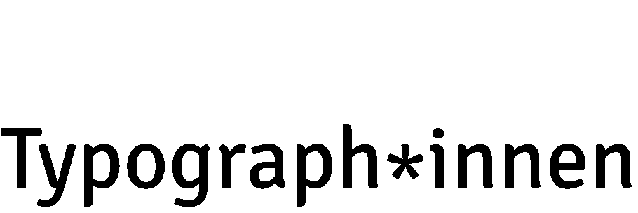

# Signika AsterX

A fork of the [Signika](https://github.com/Ancymonic/Signika) font (Anna Giedryś, 2011) where the alignment ot the asterisk matches the x-height.

<picture>
  <source media="(prefers-color-scheme: dark)" srcset="aster-x-dark.gif" width="455" height="76">
  <source media="(prefers-color-scheme: light)" srcset="aster-x-light.gif" width="455" height="76">
  
</picture>

## The German Genderstern

The [Genderstern](https://en.wikipedia.org/wiki/Gender_star) (lit. 'gender asterisk') is a typographic style used in gender-neutral German language that makes it possible to refer to all genders while also including non-binary people.

To make reading more pleasant and not interrupt the reading flow, the asterisk in this fork is aligned with the height of the lowercase letters.

## License

This Font Software is licensed under the SIL Open Font License, Version 1.1.
This license is copied below, and is also available with a FAQ at
http://scripts.sil.org/OFL
